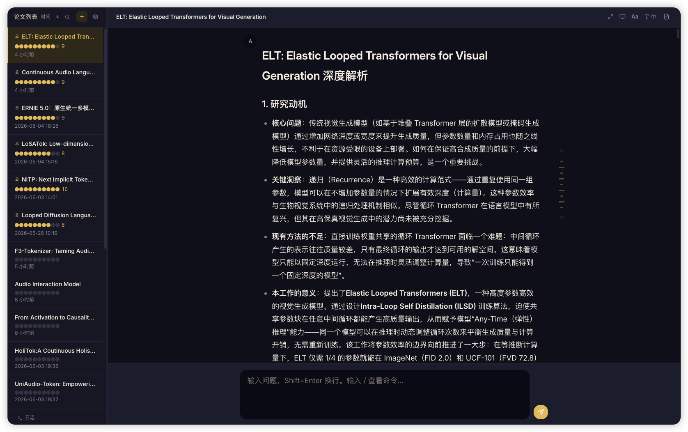
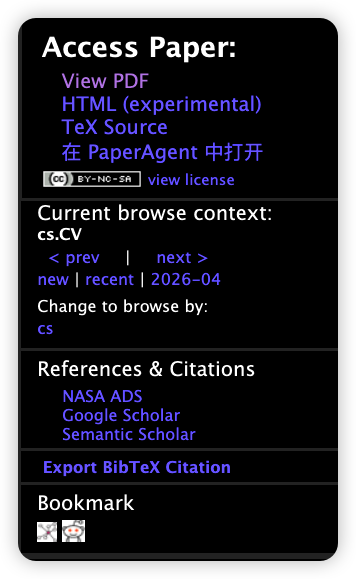
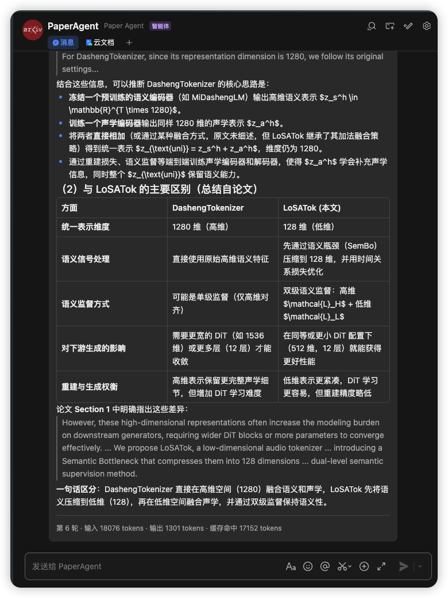

# PaperAgent 📄

[](https://github.com/happyTonakai/paperagent/actions/workflows/ci.yml)
[](https://github.com/happyTonakai/paperagent/actions/workflows/lint.yml)
[](https://github.com/happyTonakai/paperagent/releases/latest)
[](https://github.com/happyTonakai/paperagent/releases/latest)
[](https://go.dev/)
[](LICENSE)

**给你的论文装上 AI 大脑 —— 粘贴 arXiv 链接，深度解析，多轮追问；每天还有精选 arXiv 推荐自动送到飞书。**

PaperAgent 是一个 Go + Web UI 的 AI 论文阅读助手，已经从「单功能 Q&A」演化为「**Q&A + 每日推荐**」双系统产品。中文 UI / 中文文档。

- **Q&A 系统**：用户给一篇论文（URL / arXiv ID / 粘贴），AI 生成详尽摘要后进入多轮问答
- **每日推荐**：定时从 arXiv RSS 拉取新论文，LLM 按用户偏好打分，每天生成一批推荐并可推送到飞书

<p align="center">
  
  <br>
  <em>PaperAgent Web UI —— 左侧论文列表，右侧对话区域，流式渲染 AI 深度解析</em>
</p>

## Why

PaperAgent 不是一个 AI —— 它是「论文读 + 论文荐」两个紧密耦合的系统。下面分别说我们怎么解这两个场景里的问题。

### 问答系统：读论文不该这么痛

市面上已有不少 AI 能帮你「读」论文 —— Gemini、Claude 都有超长上下文，丢一篇 PDF 进去也能总结。但实际用下来有两个痛点。

**痛点一：PDF 解析本身就是个坑。**

直接从 PDF 提取文本，公式乱码、表格错位、双栏混排 —— 你花在修解析结果上的时间比读论文还多。我们的做法是：你只需要给一个 **arXiv 链接**，我们直接从 HTML/TeX 源抓取内容，自动转成干净的 Markdown，并**去除 References 等无关章节**。省去了解析 PDF 的一切烦恼。

**痛点二：超长上下文 ≠ 超准。**

现在主流 LLM 都有 1M token 上下文，听起来很美好。但论文全文本身就有几千到上万 token，再加上反复多轮问答，上下文窗口会迅速膨胀。几十轮下来，模型要在一片汪洋中找答案，准确性断崖式下降，对话历史中的噪声逐渐「淹没」论文细节，漂移和幻觉随之而来。

**我们的解法：锚点 + 动态截断。**

观察一个朴素的规律：你对一篇论文的追问往往是「发散式」的 —— 这轮在问实验设计，下轮跳到数学推导，再下轮可能回头看结论。

我们的上下文策略分三层：

1. **论文全文（始终保留）** — AI 回答的锚点，永不丢失。
2. **动态上下文窗口** — 可配置的 token 输入上限（`max_input_tokens`，默认 30000）。对话初期，所有 QA 轮次全部保留。当累计 token 接近上限时，**硬截断**到可配置的最小轮数（`min_recent_rounds`，默认 2），并以此为新「锚点」重新开始累计。我们不使用上下文压缩，而是直接截断 —— 在论文阅读中，多轮之前的问答内容已经不再重要。
3. **锚点之内、上限之下，前缀稳定** — 截断后，后续的 10+ 轮问答中前缀不再变化，KV 缓存持续命中。直到再次逼近上限，触发下一次截断。

初始生成的深度摘要则**不进入**后续对话上下文，避免占用宝贵的窗口。`/btw` 旁听消息（`SkipContext: true`）也从上下文窗口排除。

### 每日推荐：让推荐跟随你的兴趣走

市面上的 arXiv 论文推荐工具不少：Hugging Face Daily Papers、小龙虾、各种 RSS 聚合……它们大多基于**你订阅的 arXiv 分类**和**社区点赞**来推送。但实际用下来有两个痛点。

**痛点一：分类粒度太粗，兴趣在漂移。**

arXiv 的 `cs.LG`、`cs.CV` 这种大分类下每天几百篇，真正能让你产生阅读冲动的可能只有两三篇。更麻烦的是，研究者的兴趣是流动的 —— 上个月你在做 retrieval，这个月跳去 agent，剩下的几千篇「同分类」推荐都在浪费你时间。

**我们的解法：把反馈交还给 LLM。**

PaperAgent 每日推荐的全部意义就是**让推荐跟随你的兴趣走**，而不是让你去维护一个订阅列表。我们自动收集你在系统里的所有行为信号：

- 点赞 / 点踩 / 已读 / 标记为不感兴趣
- 点开论文查看 PDF / 摘要
- 从推荐卡片直接「在 PaperAgent 中打开」并进入问答
- 在 Q&A 系统中给论文打分

每天推荐流水线运行时，会把过去 24 小时的这些反馈汇总，让 LLM 自动重写 `~/.config/paperagent/preferences.md`——你的「昨天不喜欢生成式模型」会被归纳进下次打分 prompt。你也可以随时打开设置页直接编辑这个文件，覆盖 LLM 的归纳。

**痛点二：信息茧房。**

如果完全按历史反馈走，LLM 会越来越保守，只推你上次喜欢的领域。但学术上很多灵感来自跨领域意外 —— 你做 LLM 推理优化，但一篇关于编译器验证的论文可能改变你对 KV cache 的看法。

**我们的解法：自由探索。**

每天的 `daily_papers` 个推荐中，`diversity_ratio`（默认 0.3，0–1 可调）这一部分**不按分数排序**，而是从当天未上榜的论文里**随机抽取**。这些「探索位」推到你面前，给「惊喜」留出空间。你看到了觉得不错，下一轮它就会被反馈信号拉进正轨；如果不感兴趣，下一次它也不会再来。`diversity_ratio=0` 就是纯评分，`=1` 就是完全随机，推荐值 0.2–0.3。

**排除关键词（预过滤）。**

**为什么需要这套机制。** 上面那个「按 LLM 评分选 top N」的闭环看起来已经够用了，为什么还要加一层关键词预过滤？因为 `cs.AI` / `cs.LG` / `cs.CV` 这种大类每天会推 200~500 篇新论文。即便 LLM 评分每篇只读 ~500 字摘要 + 偏好，全量打分的 token 开销也是几百 k 级别；token 虽然便宜，**但没必要为了一眼就知道不想看的主题付账单**。更关键的是，**入库**这件事本身也有成本——无关论文进库后会污染「未评分」池、拖慢后续 `MarkDailyRecommendations` 的查询，甚至出现在探索位里。

所以我们做了一道「预过滤闸」：在 RSS 抓取之后、**入库之前**用一组小而精的关键词把明显不想看的主题拦在外面——词都不入库、不打分、不进推荐池，从源头省掉这一路所有后续开销。

**怎么配。** 排除关键词由用户**人工**在 `config.yaml` 中维护，写在 `recommend.excluded_keywords` 下，YAML 列表格式：

```yaml
recommend:
  excluded_keywords:
    - federated learning
    - quantum computing
    - blockchain
```

每天抓完 arXiv RSS 后、`SaveArticles` 之前，系统会用这些关键词对论文的 title + abstract 做**不区分大小写的子串匹配**；命中任何关键词的论文**直接丢弃**，连库都不入。

**负分是「闸后的二次保险」。** 漏过关键词、但被 LLM 识别为明显不喜欢的论文，打分阶段会给 `-1.0`（范围 `[-1, 1]`，`-1.0` = 明确不感兴趣 / `0.0` = 中性 / `0.0~1.0` = 有兴趣）。`MarkDailyRecommendations` 的 SQL 仍是 `score >= 0`，所以 `-1` 的论文会**自然从 top-score 和随机池中消失**，不会出现在今日推荐里。

**关键词的选取**：

- 只放**指向性明确**的技术名词或研究主题词，如 `federated learning`、`molecular dynamics`
- **不要**放宽泛词（`learning`、`model`、`network`、`data`、`optimization`）—— 会误杀绝大多数论文
- **不要**放常见英文子串（`tion`、`based`、`using`）—— 子串匹配会无差别命中
- **不要**放偶尔不喜欢但属核心方向的词——一旦误伤你会错过重要论文

节里没有关键词就直接不写这一节；写错格式（用了 `- ` 列表、代码块、JSON）解析器会拿到空、不报错；你在 Web 设置页里编辑 `preferences.md` 时也保持同一格式即可。

## 安装

### 🤖 让 AI Agent 帮你装

如果你正在使用 Claude Code / Cursor / Aider 等 AI Coding Agent，**直接把下面这行粘给它说「帮我安装 PaperAgent」即可**：

```
请按 https://raw.githubusercontent.com/happyTonakai/PaperAgent/main/INSTALL.md 的步骤，一步步安装并配置好 PaperAgent
```

Agent 会自动探测环境、下载二进制、引导你输入 API key / 飞书凭证，完成 Q&A + 每日推荐 + 飞书推送的完整配置。详见 [`INSTALL.md`](./INSTALL.md)。

### 手动安装

一行命令搞定，自动检测 OS/arch、处理 macOS Gatekeeper、Linux 库依赖检查：

```bash
curl -sSfL https://raw.githubusercontent.com/happyTonakai/PaperAgent/main/install.sh | sh
```

可选参数：

- 指定版本：`... | VERSION=v1.2.0 sh`
- 装到全局 `/usr/local/bin`（需 sudo）：`... | INSTALL_DIR=/usr/local/bin sh`

Windows 用户请去 [Releases](https://github.com/happyTonakai/PaperAgent/releases/latest) 手动下载 `paperagent_windows_amd64.exe`。

验证：

```bash
paperagent -version
```

二进制内嵌前端静态资源（React SPA），运行时无需安装 Node.js。

### 🌐 Chrome 扩展（可选）

[](https://chromewebstore.google.com/detail/paperagent/ojkppdajbpnhppadnnfpaabakmolcbkf)

<p align="center">
  
  <br>
  <em>在 arXiv 论文页面右侧栏点击「在 PaperAgent 中打开」</em>
</p>

> 📦 配套扩展，非独立客户端。实际仍需在本地运行 PaperAgent 服务端。

安装 [PaperAgent Chrome 扩展](https://chromewebstore.google.com/detail/paperagent/ojkppdajbpnhppadnnfpaabakmolcbkf) 后，在 arXiv 论文页面（`arxiv.org/abs/*`）的右侧栏 **View PDF** / **TeX Source** 下方会增加一个「在 PaperAgent 中打开」按钮。

点击按钮会：

1. 自动探测本地 PaperAgent 服务端口（默认 8686～8785）
2. 复用已有 PaperAgent 标签页（或打开新标签页），自动加载该论文并开始流式生成摘要

> 如服务端口非默认（通过 `PAPER_ADDR` 指定），可在扩展选项页中配置自定义端口。

### 自动恢复

如果论文内容因异常崩溃而丢失，打开论文或重新生成摘要时会自动从原始 arXiv URL 重新抓取内容并恢复，无需额外操作。

### 📐 arxiv2md 独立工具

PaperAgent 内置的 arXiv→Markdown 转换引擎也可以独立使用。两种路径：

- **HTML 优先**：从 arXiv HTML 提取内容，MathML 转 `$...$` 行内公式，表格保持 Markdown 对齐格式
- **TeX 备选**：下载 e-print tar.gz，自动展开 `\input`，`\begin{tabular}` 转 Markdown 表格

```bash
# 编译
just arxiv2md

# 使用：arXiv URL → 干净 Markdown
./arxiv2md https://arxiv.org/abs/2503.12345 > paper.md
```

## 配置

支持两种配置方式，按需选用即可：

### 1. 直接编辑配置文件

`~/.config/paperagent/config.yaml` 是主配置文件：

```yaml
# 论文对话系统（Q&A）使用的主 API
api:
  base_url: "https://api.openai.com/v1"
  api_key: "${OPENAI_API_KEY}"        # 自动 AES-256-GCM 加密后写盘
  default_model: "gpt-4o"

# 每日推荐订阅的 arXiv 分类
arxiv_categories: ["cs.AI", "cs.CL", "cs.LG"]

recommend:
  daily_papers: 20
  scoring_batch_size: 10
  diversity_ratio: 0.3                 # 0-1：随机探索占比
  enable_translation: true             # 是否用主 API 翻译推荐论文
  scheduled_time: "08:00"              # HH:MM
  push_to_feishu: true                 # 推荐完成后推飞书

feishu:
  enabled: true
  app_id: "cli_xxxxx"
  app_secret: "xxxxx"
  daily_recommend_chat_id: "oc_xxxxx"  # 每日推荐推送目标群

# 论文导出（Markdown 文件夹路径，支持 ~ 展开）
obsidian:
  export_path: "~/Documents/Obsidian/MyVault/Papers"

# 上下文截断参数
ui:
  min_recent_rounds: 2
  max_input_tokens: 30000
```

支持 `${ENV_VAR}` 语法引用环境变量，避免明文写入敏感信息：

```bash
export OPENAI_API_KEY="sk-..."
export OPENAI_BASE_URL="https://api.openai.com/v1"
```

然后在 `config.yaml` 中用 `api_key: "${OPENAI_API_KEY}"` 引用即可。`api_key` 写盘时自动用 AES-256-GCM 加密（密钥在 `~/.config/paperagent/.key`）。

#### 自定义 Prompt

`~/.config/paperagent/prompts/` 下放同名文件即可覆盖内置模板：

- `system.txt` — 基础系统提示词（**锁住，不允许覆写**）
- `heavy.txt` — 初始深度摘要的任务 prompt
- `light.txt` — 问答阶段的任务 prompt
- `summarize.txt` — 对话元总结的任务 prompt
- `scoring.txt` — 论文评分 prompt
- `update-prefs.txt` — 偏好更新 prompt

### 2. Web UI 设置页面

程序运行后打开浏览器，点击右上角齿轮图标，可以在 Web 界面中直接修改所有配置（5 个 tab：API 与凭据 / 提示词模板 / 飞书机器人 / 推荐系统 / 推荐偏好），修改即时生效。密码字段默认遮罩，可点眼睛图标查看。首次启动若 `config.yaml` 不存在，会自动弹出设置对话框引导用户配置 API 密钥。

### 飞书 Bot（可选）

启用后在飞书群聊/私聊中使用斜杠命令操作论文，并可接收每日推荐推送：

| 命令 | 功能 |
|---|---|
| `/new <url>` | 创建论文总结（流式卡片实时更新） |
| `/list` | 论文列表（分页卡片 + 搜索高亮 + 翻页导航） |
| `/search <关键词>` | 按标题搜索论文，结果格式同 `/list` |
| `/summary` | 拉取当前论文初始总结 |
| `/fetch [n]` | 拉取最近 n 轮问答（默认 2） |
| `/chat <问题>` | 对当前论文多轮 Q&A |
| `/btw <问题>` | 提问但不记入上下文 |
| `/rate <1-10>` | 给当前论文打分 |
| `/pin` | 置顶/取消置顶当前论文 |
| `/help` | 帮助信息 |

直接发消息（不带 `/` 前缀）即可对当前论文多轮 Q&A。配置保存后自动热加载，无需重启。

<p align="center">
  
  <br>
  <em>飞书群聊中使用斜杠命令与 PaperAgent 交互</em>
</p>

**飞书开放平台配置要求**：

- 开启机器人能力
- 权限：`im:message`、`im:message:send_as_bot`
- 事件订阅：`im.message.receive_v1`、`card.action.trigger`

## 每日推荐

PaperAgent 每天会按你配置的 arXiv 分类拉取新论文，**用 LLM 按你写的研究偏好打分**，选 Top N 推送到飞书（可选）。

**推荐流水线**（每天触发一次）：

1. 收集昨日反馈（你点赞/点踩/已读/打分/点击 PDF 的论文）
2. LLM 把反馈合成新的 `preferences.md`（你在设置里也能直接编辑）
3. 从 arXiv RSS 拉新论文（按 arXiv ID 去重，过滤 `replace` 公告）
4. **关键词预过滤**：用 `config.yaml` 中 `recommend.excluded_keywords` 里的关键词对 title/abstract 做不区分大小写的子串匹配；命中的论文不入库。**该过滤由用户人工维护，LLM 不再生成排除关键词。**
5. LLM 批量打分（复用主 API）—— 漏过关键词但被 LLM 识别为明显不喜欢的论文打 `-1.0`，从推荐池中排除
6. 混合策略选 top N：`daily_papers × (1 - diversity_ratio)` 走 top score（`score >= 0`），其余随机探索（同样 `score >= 0`）
7. 拉 HuggingFace / AlphaXiv 票数（仅展示，不入排序）
8. 可选：如果 `enable_translation: true`，用主 API 把标题/摘要翻译成中文
9. 推送飞书交互卡片到 `daily_recommend_chat_id`（点赞/点踩/已读/进入对话）
10. 推送前判断节假日：通过多个 API 链式查询节假日数据，兜底到周末判断。节假日跳过推送（论文照常评分入库），下一工作日和积压推荐合并推送。Web UI / 飞书 `/push` 命令可强制推送，跳过节假日判断。

> 第一天推送会用空偏好打分；你给反馈后从第二天起 LLM 持续更新 `preferences.md`。`preferences.md` 在 `~/.config/paperagent/preferences.md`，可手动编辑。

## 使用

### 启动

```bash
# 启动 Web UI（默认）：浏览器自动打开，端口被占用时自动 +1
./paperagent

# 开发模式：Go 后端 + Vite HMR 前端，浏览器访问 http://localhost:5173
just dev

# 指定监听地址
PAPER_ADDR=":9000" ./paperagent
```

> 开发模式自动设置 `PAPER_NO_BROWSER=1`（禁止自动打开浏览器）和 `PAPER_FOREGROUND=1`（禁止后台 daemonize）。手动启动时也可通过这两个环境变量控制行为。

### Web UI 操作

| 操作 | 方式 |
|---|---|
| 新建论文 | 点击左侧"+"按钮，输入 arXiv URL |
| 快捷新建 | 直接粘贴 arXiv 链接到底部输入框，按 Enter 自动创建 |
| 搜索论文 | 点击 🔍 按钮或按 `Cmd+Shift+F`，实时过滤论文列表 |
| 选择论文 | 点击左侧论文列表 |
| 切换 Tab | 顶部：💬 论文对话 / 📅 每日推荐 |
| 置顶/取消置顶 | 右键论文 → 置顶/取消置顶，置顶论文排在列表最前 |
| 提问 | 底部输入框输入问题，Enter 发送 |
| 换行 | Shift+Enter |
| 重新生成回答 | 鼠标悬浮 AI 回复 → 🔄 按钮 → 确认 |
| 删除轮次 | 鼠标悬浮 AI 回复 → 🗑️ 按钮 → 确认 |
| 命令 | 输入 `/` 触发命令补全 |
| `/export` | 导出当前论文到配置的导出文件夹 |
| `/config` | 打开设置 |
| `/btw <问题>` | 提问但不记入上下文 |
| 复制原文 | 鼠标悬浮在 AI 回复上，点击 📋 按钮复制原始 Markdown |
| `/help` | 显示帮助 |
| 每日推荐 | 切换到「每日推荐」Tab，可浏览/打分/评论/搜索历史推荐 |

> **自动恢复**：关闭 PaperAgent 后重新打开，自动恢复到最后阅读的论文。

> **注意**：只支持通过 arXiv 链接加载论文。

## 架构

**双系统架构**：

```
            ┌──────────────────┐
            │   Web UI (React) │
            └────────┬─────────┘
                     │ HTTP / SSE
            ┌────────▼─────────┐
            │   HTTP Server    │  internal/server/
            │  (embed.FS SPA)  │  + handlers_recommend.go
            └────┬──────┬──────┘
                 │      │
   ┌─────────────┘      └──────────────┐
   ▼                                  ▼
┌──────────────┐               ┌──────────────┐
│  Q&A System  │               │  Recommend   │
│  session/    │               │  recommend/  │
│  api/        │               │  database/   │
│  chat/       │               │  scheduler/  │
│  prompt/     │               │              │
│  urlparse/   │               │              │
└──────┬───────┘               └──────┬───────┘
       │                              │
       └──────────┬───────────────────┘
                  ▼
          ┌──────────────┐
          │  config/     │
          │  export/     │
          │  feishu/     │
          │  systray/    │
          └──────────────┘
```

**进程模型**：`main.go` 加载配置 → `daemonize()`（非 Windows 下默认调用 `setsid`）→ `systray.Run()` 启动系统托盘；托盘 `onReady` 中启动 HTTP server、飞书 bot（如果 `feishu.enabled`）、每日推荐 scheduler，然后打开浏览器。SIGINT/SIGTERM 走托盘 `Quit` 路径优雅退出。

### Q&A 二阶段状态机

- **INIT**：`system.txt` + 论文全文 + `heavy.txt` 任务提示 → API → SSE 流式输出 Markdown 摘要；title 从 arXiv HTML 解析
- **CHAT**：每轮 = `system.txt` + 论文全文 + `light.txt` + 动态上下文（从 `TruncationAnchor` 算起；超 `max_input_tokens` 硬截断到 `min_recent_rounds`） ≫ LLM 可调用工具（`fetch_arxiv` 获取另一篇论文做交叉对比、`get_references` 查看参考文献）≫ SSE 流式回复

### 每日推荐流水线（每天触发一次）

1. **收集反馈**：`CollectYesterdayFeedback()` 汇集推荐系统（`articles.status`）和 Q&A 系统（`chat_papers.updated_at` + rating）的反馈信号
2. **更新偏好**：`UpdatePreferences()` 用 LLM 把反馈合成新的 `preferences.md`
3. **拉 RSS**：`FetchArxivRSS(categories, 100)` 从配置的 arXiv category 拉新论文（按 arXiv ID 去重，过滤 `replace` 公告）
4. **关键词预过滤**：`FilterArticlesByKeywords()` 用 `config.Recommend.ExcludedKeywords` 内的关键词对 title/abstract 做子串匹配；命中的论文不入库（详见下方配置说明）
5. **LLM 打分**：`ScoreArticlesBatch()` 按偏好 + 摘要批量打分；明确不感兴趣的论文得 `-1.0`
6. **选 top N**：`MarkDailyRecommendations()` 用 `score >= 0` 过滤（`UpdateArticleScores` 后的论文、`-1.0` 自动出局）
7. **拉社区票数**：`FetchVotesForArticles()` 并行查 HuggingFace / AlphaXiv
8. **翻译**（可选）：若 `enable_translation` 为 true，用主 API 翻译
9. **推飞书**：`PushDailyRecommend()` 推送交互卡片
10. **节假日跳过**：推送前通过 `holiday.Checker.IsHoliday()` 判断（多 API 链式查询 + 周末兜底），节假日跳过推送，积压到下一工作日合并推。

`Scheduler` 每分钟醒一次，看是否到 `scheduled_time` 且今天没跑过。

### 模块布局

| Package | 职责 |
|---|---|
| `config/` | `~/.config/paperagent/config.yaml` 加载、env var override、AES-256-GCM 加密 API key、路径 helper |
| `api/` | OpenAI 兼容 HTTP 客户端，同步 / SSE 流式（`<-chan StreamChunk`）。提供 `FetchArxivTool()` / `GetReferencesTool()` 供 LLM 调用 |
| `chat/` | 共享 Q&A 引擎（`Engine` + `Sink` 接口），Web SSE / 飞书统一使用。消息构造、LLM 流式循环、工具调用分派 |
| `session/` | `Paper` / `Message` 模型（含 `ToolCalls` / `ToolCallID` 字段），`Manager` 持久化到 `~/.config/paperagent/papers/{uuid}.json` |
| `prompt/` | `//go:embed` 模板：`system.txt` / `heavy.txt` / `light.txt` / `summarize.txt` / `scoring.txt` / `update-prefs.txt` |
| `urlparse/` | arXiv URL/ID 归一化，所有公开函数接受 `ctx context.Context` 支持调用方取消，HTML 优先 → TeX → PDF |
| `export/` | 导出到 `obsidian.export_path` 的 Markdown 文件 |
| `database/` | SQLite 池（`modernc.org/sqlite`，纯 Go 零 CGO），`articles` / `chat_papers` 表 |
| `recommend/` | RSS 拉取、LLM 打分、偏好更新、票数、推荐算法主入口 |
| `scheduler/` | cron 风格调度器，`onComplete` 回调触发翻译 + 推飞书 |
| `server/` | HTTP server（`//go:embed frontend-dist`），`sseSink` 实现 `chat.Sink` 驱动 SSE 流式响应，日志环形缓冲 |
| `systray/` | `fyne.io/systray` 封装，菜单项 + 左键直接开浏览器 |
| `feishu/` | 飞书机器人，WebSocket 事件分发，slash 命令处理，交互卡片。`cardSink` 实现 `chat.Sink` 驱动聊天流式卡片 |

### API 端点

| 端点 | 方法 | 说明 |
|---|---|---|
| `/api/papers` | POST | 新建论文（URL → 抓取 → INIT 摘要流式输出 via SSE） |
| `/api/papers` | GET | 论文列表 |
| `/api/papers/{id}` | GET | 获取论文详情 + 对话历史 |
| `/api/papers/{id}` | DELETE | 删除论文 |
| `/api/papers/{id}/chat` | POST | 提问（SSE 流式回复） |
| `/api/papers/{id}/pin` | PATCH | 置顶/取消置顶论文 |
| `/api/papers/{id}/title` | PATCH | 更新论文标题 |
| `/api/papers/{id}/rating` | PATCH | 更新论文评分 |
| `/api/papers/{id}/retry-summary` | POST | 重新生成/续写摘要（SSE） |
| `/api/papers/{id}/chat/{n}/retry` | POST | 重新生成第 n 轮回答（SSE） |
| `/api/papers/{id}/export` | POST | 导出到 Obsidian |
| `/api/papers/{id}/rounds/{n}` | DELETE | 删除指定轮次及该轮所有消息 |
| `/api/active-paper` | GET | 获取当前活跃论文 ID |
| `/api/active-paper` | PUT | 设置当前活跃论文 ID |
| `/api/config` | GET | 查看配置 |
| `/api/config` | POST | 更新配置 |
| `/api/config/status` | GET | 配置存在性 + API key 是否已配置（用于首启引导） |
| `/api/prompts` | GET | 查看内置/自定义提示词模板列表 |
| `/api/prompts` | POST | 保存自定义提示词覆盖 |
| `/api/feishu/status` | GET | 飞书连接状态（connected / enabled / last_error） |
| `/api/recommend/config` | GET | 推荐系统配置 |
| `/api/recommend/config` | PUT | 更新推荐系统配置 |
| `/api/recommend/preferences` | GET | 查看偏好 Markdown |
| `/api/recommend/preferences` | PUT | 保存偏好 Markdown |
| `/api/recommend/scheduler-status` | GET | Scheduler 当前状态（运行中/待命中、上次/下次执行时间、错误） |
| `/api/recommend/articles` | GET | 推荐论文列表（分页 + 过滤） |
| `/api/recommend/articles/{id}` | PATCH | 更新推荐状态（点赞/点踩/已读/评论） |
| `/api/recommend/trigger` | POST | 手动触发一次推荐流水线 |
| `/api/logs` | GET | 内存日志环形缓冲（最近 N 条） |

所有流式端点使用 Server-Sent Events (SSE)，事件类型：`created` / `chunk` / `done` / `error` / `title` / `tool_call`。

### 数据持久化

- **Q&A**：`~/.config/paperagent/papers/{uuid}.json`，包含完整论文内容、摘要、对话历史。支持 UUID 会话 ID 和旧版数字 ID 向后兼容
- **推荐系统**：`~/.config/paperagent/zenflow.db`（SQLite，WAL 模式），`articles`（推荐论文、状态、票数）和 `chat_papers`（Q&A 元数据快照）两张表
- **首次启动**会自动从 `papers/*.json` 迁移到 `chat_papers` 表

## 开发

```bash
# 查看所有 justfile recipe
just --list

# 开发模式（Go + Vite HMR 并发）
just dev

# 完整构建（前端 + Go），产出单二进制
just build

# 独立 arxiv2md 工具
just arxiv2md

# 静态分析
just vet                # Go vet
just lint               # golangci-lint v2（与 CI .github/workflows/lint.yml 同配置）
just typecheck          # 前端 tsc --noEmit

# 单元测试（不打 API）
go test ./internal/config/ ./internal/session/ ./internal/prompt/ \
        ./internal/urlparse/ ./internal/export/ ./internal/database/ \
        ./internal/recommend/ -v

# 全部测试
go test ./... -v

# 清理
just clean
```

开发模式下，前端通过 Vite 代理请求到 Go 后端，实现前后端独立热更新。

> **提示**：开发模式自动设置 `PAPER_NO_BROWSER=1`（禁止自动打开浏览器）和 `PAPER_FOREGROUND=1`（禁止后台运行）。手动启动时也可通过这两个环境变量控制行为。

## 技术栈

| 层 | 技术 |
|---|---|
| 前端 UI | React 19, TypeScript, Tailwind CSS 4, Vite 6 |
| 状态管理 | Zustand 5 |
| 数据请求 | TanStack React Query 5 |
| Markdown 渲染 | react-markdown + remark-math + rehype-katex + rehype-highlight |
| 图标 | Lucide React |
| Toast | sonner |
| 后端 | Go 1.25+ (net/http, embed) |
| SSE 流式 | Server-Sent Events |
| LLM API | OpenAI 兼容接口 |
| 持久化 (Q&A) | JSON 文件 (~/.config/paperagent/papers/) |
| 持久化 (推荐) | SQLite via `modernc.org/sqlite`（纯 Go 零 CGO），WAL 模式 |
| 飞书 | `larksuite/oapi-sdk-go/v3`，WebSocket + 交互卡片 |
| 系统托盘 | `fyne.io/systray` |
| 公式 | KaTeX |
| 代码高亮 | highlight.js |

## 许可

MIT
